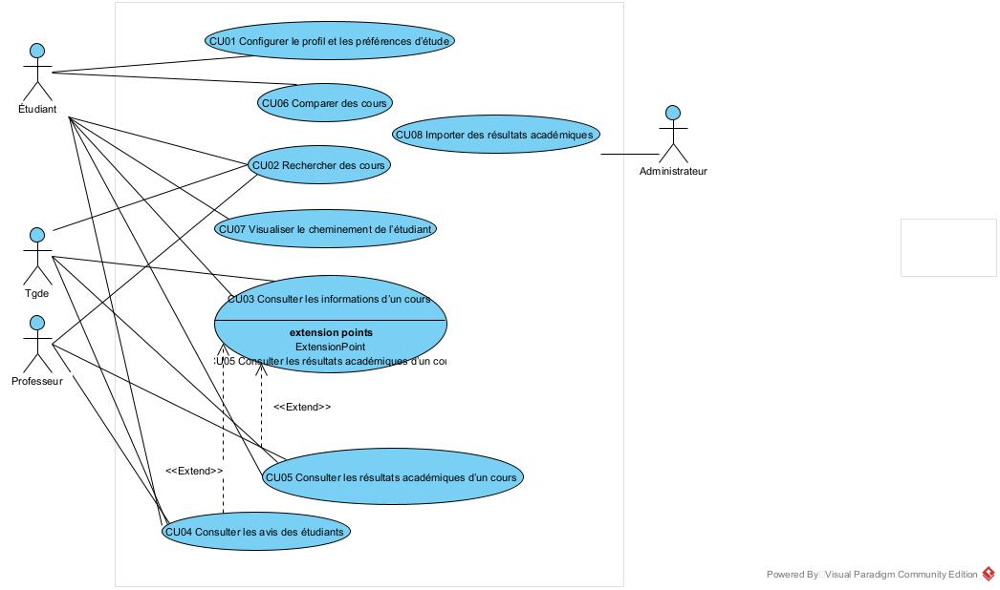

# Cas d'utilisation

## Vue d’ensemble

Les cas d’utilisation décrivent les interactions principales entre les différents acteurs  
(étudiants, TGDEs, professeurs, administrateur) et la plateforme **OptiCoursUdeM**.  
Ils traduisent les besoins en fonctionnalités concrètes du point de vue des utilisateurs.

**Hypothèse générale**  
L’authentification des utilisateurs est gérée par les systèmes de l’UdeM (SSO).  
Les cas d’utilisation d’OptiCoursUdeM commencent une fois l’utilisateur déjà identifié  
et présent dans l’interface de l’outil. Il n’y a donc **pas** de cas d’utilisation « Se connecter ».

## Identification des acteurs

- **Étudiant** : utilisateur principal qui recherche des cours, consulte les avis et résultats, compare des cours et personnalise ses préférences.
- **TGDE (Technicien·ne en gestion des dossiers étudiants)** : consulte le cheminement des étudiants et les aide à valider leurs choix de cours.
- **Professeur / Chargé de cours** : consulte les statistiques agrégées de ses propres cours (résultats académiques, taux d’échec, avis étudiants).
- **Administrateur du système** : gère l’import des données académiques et la configuration de la synchronisation des avis Discord.
- **Système Discord (bot)** : système externe qui transmet les avis étudiants anonymisés vers le backend (acteur secondaire, non humain).

## Liste des cas d’utilisation (version corrigée)

| ID   | Nom                                               | Acteurs principaux                              | Description |
|------|---------------------------------------------------|-------------------------------------------------|------------|
| CU01 | Configurer le profil et les préférences d’étude   | Étudiant                                        | Permet à l’étudiant de définir ses préférences (intérêts, charge de travail, horaires, etc.) afin de personnaliser les recherches et comparaisons de cours. |
| CU02 | Rechercher des cours                              | Étudiant, TGDE                                  | Permet de trouver des cours selon différents critères (code, titre, mots-clés, cycle, session, domaine, charge estimée). |
| CU03 | Consulter les informations d’un cours             | Étudiant, TGDE, Professeur                      | Affiche toutes les informations d’un cours (description, horaires, prérequis, professeur, éligibilité). |
| CU04 | Consulter les avis des étudiants                  | Étudiant, TGDE, Professeur                      | Affiche les avis agrégés d’étudiants pour un cours lorsque le nombre d’avis valides est suffisant. |
| CU05 | Consulter les résultats académiques d’un cours    | Étudiant, TGDE, Professeur                      | Affiche les statistiques académiques agrégées (moyenne, nombre d’inscrits, échecs) pour un cours. |
| CU06 | Comparer des cours                                | Étudiant                                        | Permet de comparer plusieurs cours (charge de travail, avis, résultats académiques, éligibilité). |
| CU07 | Visualiser le cheminement de l’étudiant           | Étudiant, TGDE                                  | Permet de visualiser le cheminement dans le programme (cours complétés, en cours, restants) et les contraintes de crédits. |
| CU08 | Importer des résultats académiques                | Administrateur                                  | Permet de charger un fichier CSV de résultats académiques agrégés dans le système. |

## Diagramme de cas d’utilisation

*(À mettre à jour dans Visual Paradigm pour respecter le formalisme UML, voir section 3.)*

---

## Détail des cas d’utilisation

### CU01 – Configurer le profil et les préférences d’étude

**But** : Permettre à l’étudiant de configurer ses préférences pour personnaliser les recherches et les recommandations de cours.

**Acteur principal** : Étudiant  

**Préconditions** :  
- L’étudiant a déjà accès à l’interface d’OptiCoursUdeM.

**Postconditions** :  
- Les préférences sont sauvegardées et seront utilisées lors des recherches et comparaisons de cours.

#### Scénario principal

1. L’étudiant ouvre la page « Mon profil » depuis le tableau de bord.
2. Le système affiche le formulaire de préférences actuel (intérêts, charge de travail souhaitée, plages horaires préférées, etc.).
3. L’étudiant modifie ou renseigne ses préférences.
4. L’étudiant clique sur « Enregistrer ».
5. Le système valide les données (format, champs obligatoires).
6. Le système sauvegarde les préférences dans la base de données.
7. Le système affiche un message de confirmation : « Vos préférences ont été mises à jour ».

#### Scénarios alternatifs

5a. Certains champs facultatifs sont laissés vides.  
  5a.1. Le système complète ces champs avec des valeurs par défaut (ex. « charge de travail moyenne »).  
  5a.2. Le système sauvegarde les préférences avec ces valeurs par défaut.

5b. Une erreur technique survient lors de la sauvegarde.  
  5b.1. Le système n’arrive pas à enregistrer les données.  
  5b.2. Le système affiche : « Erreur lors de l’enregistrement de vos préférences. Veuillez réessayer ».

---

### CU02 – Rechercher des cours

**But** : Permettre à un étudiant ou un TGDE de trouver des cours à partir de différents critères.

**Acteurs principaux** : Étudiant, TGDE  
**Acteurs secondaires** : API Planifium, base de données interne (résultats académiques, avis)

**Préconditions** :  
- L’utilisateur a accès à l’interface d’OptiCoursUdeM.

**Postconditions** :  
- Une liste de cours correspondant aux critères de recherche est affichée avec les informations principales et un badge d’éligibilité.

#### Scénario principal

1. L’utilisateur accède à la page « Rechercher des cours ».
2. Le système affiche un formulaire de recherche (code/titre/mot-clé + filtres : session, cycle, charge estimée, domaine).
3. L’utilisateur saisit un critère (ex. « IFT2255 » ou « apprentissage ») et sélectionne éventuellement des filtres.
4. L’utilisateur clique sur « Rechercher ».
5. Le système interroge l’API Planifium pour récupérer la liste des cours correspondants (code, titre, horaires, session, professeur).
6. Le système interroge la base de données interne pour associer, à chaque cours, les statistiques agrégées (résultats académiques, nombre d’avis valides).
7. Le système calcule, pour chaque cours, l’éligibilité de l’étudiant (prérequis, corequis, cycle, contraintes de programme).
8. Le système affiche la liste de résultats, chaque ligne contenant au minimum :  
   - code, titre, session, professeur ;  
   - badge d’éligibilité (« Éligible », « Non éligible », « Prérequis à compléter ») ;  
   - indicateurs de base (charge estimée, nombre d’avis valides, présence ou non de résultats académiques).

#### Scénarios alternatifs

5a. Aucune donnée trouvée.  
  5a.1. L’API Planifium ne retourne aucun cours correspondant.  
  5a.2. Le système affiche : « Aucun cours trouvé pour ces critères ».  
  5a.3. Le système propose d’élargir les filtres ou de revenir au formulaire de recherche.

6a. Données partielles ou manquantes pour certains cours.  
  6a.1. Le système détecte que :  
        - il y a moins de 5 avis valides ; et/ou  
        - aucun résultat académique n’est disponible pour la session sélectionnée.  
  6a.2. Le système affiche un pictogramme d’avertissement et un texte explicite :  
        - « Avis étudiants insuffisants (moins de 5 avis valides) » ;  
        - « Aucune donnée académique disponible pour cette session ».  
  6a.3. L’utilisateur peut quand même ouvrir les informations détaillées du cours (CU03).

---

### CU03 – Consulter les informations d’un cours

**But** : Permettre de voir l’ensemble des informations détaillées sur un cours.

**Acteurs principaux** : Étudiant, TGDE, Professeur  
**Acteurs secondaires** : API Planifium, base de données interne

**Préconditions** :  
- CU02 – Rechercher des cours a été exécuté et un cours a été sélectionné.

**Postconditions** :  
- L’utilisateur visualise les informations complètes du cours et peut ensuite lancer CU04, CU05 ou CU06.

#### Scénario principal

1. Depuis la liste de résultats de CU02, l’utilisateur clique sur un cours.
2. Le système récupère les détails du cours (description, objectifs, crédits, langue, session, groupe, salle, horaire, professeur).
3. Le système calcule ou affiche l’éligibilité pour l’étudiant (si acteur = étudiant ou TGDE).
4. Le système affiche une fiche structurée en sections :  
   - Informations générales (code, titre, crédits, description, professeur) ;  
   - Pré-requis / co-requis ;  
   - Horaire et groupes ;  
   - Liens vers « Avis des étudiants », « Résultats académiques », « Ajouter à la comparaison ».

#### Scénarios alternatifs

2a. Une erreur survient lors de la récupération des informations.  
  2a.1. Le système affiche : « Impossible de charger les informations de ce cours pour le moment ».  
  2a.2. L’utilisateur peut revenir à la liste des résultats.

---

### CU04 – Consulter les avis des étudiants

**But** : Afficher les avis agrégés des étudiants sur un cours.

**Acteurs principaux** : Étudiant, TGDE, Professeur  
**Acteurs secondaires** : Base de données interne

**Préconditions** :  
- CU03 – Consulter les informations d’un cours.

**Postconditions** :  
- L’utilisateur visualise les indicateurs agrégés (note globale, difficulté perçue, charge estimée) et, si nécessaire, un message expliquant les limites des données.

**Relation** :  
- `<<extend>>` CU03 – Consulter les informations d’un cours.

#### Scénario principal

1. Depuis les informations d’un cours, l’utilisateur clique sur l’onglet ou le bouton « Avis des étudiants ».
2. Le système vérifie le nombre d’avis valides disponibles.
3. Si le nombre d’avis valides est ≥ 5, le système calcule les agrégats (moyenne, difficulté, charge de travail estimée).
4. Le système affiche les indicateurs agrégés, quelques commentaires anonymisés et la période concernée.

#### Scénarios alternatifs

2a. Nombre d’avis valides < 5.  
  2a.1. Le système n’affiche aucun indicateur agrégé.  
  2a.2. Le système affiche : « Avis étudiants insuffisants (moins de 5 avis valides) pour ce cours ».

2b. Aucun avis disponible.  
  2b.1. Le système affiche : « Aucun avis étudiant disponible pour ce cours ».

---

### CU05 – Consulter les résultats académiques d’un cours

**But** : Afficher les statistiques académiques agrégées d’un cours.

**Acteurs principaux** : Étudiant, TGDE, Professeur  
**Acteurs secondaires** : Base de données interne (données CSV importées)

**Préconditions** :  
- CU03 – Consulter les informations d’un cours.

**Postconditions** :  
- L’utilisateur voit les statistiques académiques pertinentes pour le cours et la session choisie.

#### Scénario principal

1. Depuis les informations d’un cours, l’utilisateur clique sur « Résultats académiques ».
2. Le système recherche dans les données importées les résultats pour ce cours et cette session.
3. Le système calcule, si nécessaire, la moyenne, le nombre d’inscrits et le nombre d’échecs.
4. Le système affiche un tableau récapitulatif (session, moyenne, inscrits, échecs, commentaire éventuel).

#### Scénarios alternatifs

2a. Aucune donnée académique pour ce cours et cette session.  
  2a.1. Le système affiche : « Aucune donnée académique disponible pour ce cours à la session [H2024] ».  
  2a.2. Le système propose, si possible, une session antérieure disposant de données.

---

### CU06 – Comparer des cours

**But** : Permettre à l’étudiant de comparer plusieurs cours pour estimer la charge globale et choisir les plus pertinents.

**Acteur principal** : Étudiant  

**Préconditions** :  
- CU02 – Rechercher des cours a été utilisé et au moins deux cours ont été sélectionnés.

**Postconditions** :  
- Un tableau comparatif est affiché et l’étudiant peut ajuster sa sélection.

#### Scénario principal

1. Depuis la liste de résultats ou les informations d’un cours, l’étudiant clique sur « Ajouter à la comparaison ».
2. Le système maintient une liste des cours sélectionnés.
3. L’étudiant clique sur « Voir comparaison ».
4. Le système récupère, pour chaque cours :  
   - crédits et charge de travail estimée ;  
   - statut d’éligibilité ;  
   - indicateurs d’avis (si disponibles) ;  
   - résultats académiques (si disponibles).
5. Le système affiche un tableau comparatif (une ligne par cours, une colonne par critère).
6. Le système calcule et affiche la charge totale de travail estimée si l’étudiant suivait tous les cours sélectionnés.

#### Scénarios alternatifs

2a. Un cours ne possède ni avis ni résultats académiques.  
  2a.1. Le système affiche : « Aucune donnée disponible » dans les colonnes concernées.  
  2a.2. Le système met en évidence cette absence avec un pictogramme.

1b. L’étudiant retire un cours de la comparaison.  
  1b.1. L’étudiant clique sur « Retirer » à côté du cours.  
  1b.2. Le système met à jour le tableau et recalcule la charge totale.

---

### CU07 – Visualiser le cheminement de l’étudiant

**But** : Permettre à l’étudiant ou au TGDE de visualiser le cheminement dans le programme et l’état d’avancement (cours complétés, en cours, restants).

**Acteurs principaux** : Étudiant, TGDE  
**Acteurs secondaires** : Base de données des programmes et cheminements

**Préconditions** :  
- Le programme de l’étudiant est connu (profil ou données institutionnelles).

**Postconditions** :  
- L’utilisateur voit la liste des cours obligatoires et optionnels, avec leur statut (complété, en cours, à faire).

#### Scénario principal

1. Depuis le tableau de bord, l’utilisateur clique sur « Mon cheminement » ou « Cheminement de l’étudiant ».
2. Le système récupère les informations de programme (blocs de cours, crédits, contraintes).
3. Le système récupère la liste des cours réussis, en cours et échoués.
4. Le système calcule, pour chaque bloc, ce qui est complété et ce qui reste à faire.
5. Le système affiche une vue structurée :  
   - cours complétés (avec session et note) ;  
   - cours en cours ;  
   - cours restants avec prérequis et suggestions d’inscription.

#### Scénarios alternatifs

2a. Programme inconnu ou incomplet.  
  2a.1. Le système affiche : « Impossible de déterminer votre programme. Veuillez contacter un TGDE ».  
  2a.2. L’utilisateur ne peut pas accéder à la vue de cheminement.

3a. Certaines données de résultats sont manquantes.  
  3a.1. Le système marque certains cours comme « statut inconnu ».  
  3a.2. Le système affiche :  
        « Certaines informations de résultats sont manquantes, veuillez vérifier auprès du Centre étudiant ».

---

### CU08 – Importer des résultats académiques

**But** : Permettre à l’administrateur de charger un fichier CSV de résultats académiques agrégés dans le système.

**Acteur principal** : Administrateur  
**Acteurs secondaires** : Base de données interne

**Préconditions** :  
- L’administrateur dispose d’un fichier CSV conforme au format attendu (données agrégées, anonymes).

**Postconditions** :  
- Les nouvelles données académiques sont intégrées et disponibles pour CU05 et CU06.

#### Scénario principal

1. L’administrateur ouvre la page « Importer des résultats académiques ».
2. Le système affiche un formulaire pour téléverser un fichier CSV et décrit le format attendu.
3. L’administrateur sélectionne le fichier CSV et clique sur « Importer ».
4. Le système vérifie la structure du fichier (en-têtes, types de colonnes, anonymisation).
5. Si la structure est valide, le système insère ou met à jour les données dans la base.
6. Le système affiche un récapitulatif : nombre de cours mis à jour, lignes ignorées, etc.

#### Scénarios alternatifs

4a. Format de fichier invalide.  
  4a.1. Le système interrompt l’import.  
  4a.2. Le système affiche : « Format de fichier invalide : colonne “moyenne” manquante ».

4b. Données non agrégées ou identifiantes.  
  4b.1. Le système détecte des colonnes interdites (ex. numéro étudiant, nom).  
  4b.2. Le système refuse l’import et affiche :  
        « Import refusé : les données doivent être agrégées et anonymes (Loi 25) ».
