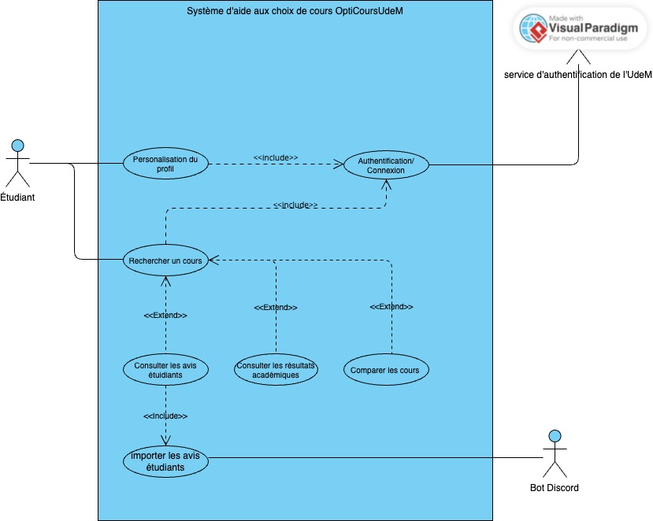

# Cas d'utilisation

## Vue d’ensemble

Les cas d’utilisation (CU) décrivent les interactions principales entre les acteurs (étudiants, système) et la plateforme.  
Ils permettent de traduire les besoins en fonctionnalités concrètes, visibles depuis le point de vue des utilisateurs.

## Liste des cas d’utilisation

| ID | Nom | Acteurs principaux | Description |
|----|-----|------------------|-------------|
| CU01 | Connexion | Étudiant | L'étudiant se connecte à l'application pour accéder à ses fonctionnalités |
| CU02 | Rechercher un cours | Étudiant | Permet à l’étudiant de rechercher un ou plusieurs cours selon des critères |
| CU03 | Comparer plusieurs cours | Étudiant | Permet de comparer des cours pour évaluer la charge totale et compatibilité |
| CU04 | Consulter avis étudiants | Étudiant | Affiche les avis agrégés sur un cours depuis Discord |
| CU05 | Consulter résultats académiques | Étudiant | Affiche les moyennes, nombre d’inscrits et d’échecs par cours |
| CU06 | Personnaliser profil | Étudiant | Permet à l’étudiant de renseigner ses préférences pour filtrer les résultats |

## Détail

### CU01 - Connexion

**Nom** : Connexion  
**But** : Un étudiant souhaite se connecter à l'application pour accéder à ses fonctionnalités.  
**Acteurs** : Étudiant (principal), Système (secondaire)  
**Préconditions** : L’étudiant possède un compte valide et une connexion internet.  
**Postconditions** : L’étudiant est authentifié et peut accéder aux fonctionnalités disponibles.  
**Déclencheur** : L’étudiant ouvre l’application et clique sur “Connexion”.  
**Dépendances** : Aucun (cas de base).  

#### Scénario principal
1. L’étudiant ouvre l’application.  
2. L’étudiant saisit ses identifiants (nom d’utilisateur et mot de passe).  
3. Le système vérifie la validité des identifiants.  
4. Le système authentifie l’étudiant et affiche le tableau de bord.  

#### Scénarios alternatifs
3a. Les identifiants sont incorrects.  
  3a.1. Le système affiche un message d’erreur.  
  3a.2. L’étudiant peut ressaisir ses identifiants.  
3b. Le compte est suspendu.  
  3b.1. Le système affiche “Compte suspendu”.  
  3b.2. L’étudiant ne peut pas accéder à l’application.  

---

### CU02 - Rechercher un cours

**Nom** : Rechercher un cours  
**But** : Un étudiant souhaite trouver un ou plusieurs cours selon des critères précis.  
**Acteurs** : Étudiant (principal), Système (secondaire)  
**Préconditions** : Étudiant connecté au système.  
**Postconditions** : Les cours correspondant aux critères sont affichés, avec éligibilité et informations pertinentes.  
**Déclencheur** : L’étudiant saisit un mot clé, code ou titre dans la barre de recherche.  
**Dépendances** : CU01 - Connexion.  

#### Scénario principal
1. L’étudiant écrit un code, titre ou mot clé dans la barre de recherche.  
2. Le système récupère les informations de Planifium, les résultats académiques et les avis étudiants.  
3. Le système filtre et agrège les données selon le profil de l’étudiant.  
4. Le système affiche la liste des cours correspondant aux critères, avec informations pertinentes (prérequis, co-requis, charge estimée, avis).  

#### Scénarios alternatifs
2a. Aucune donnée trouvée pour le critère saisi.  
  2a.1. Le système affiche “Aucun cours trouvé”.  
  2a.2. L’étudiant peut modifier les critères et relancer la recherche.  
3a. Données partielles ou manquantes (ex : moins de 5 avis).  
  3a.1. Le système affiche les informations disponibles avec un avertissement sur la fiabilité. 
   
### CU03 - Comparer plusieurs cours

**Nom** : Comparer plusieurs cours  
**But** : L’étudiant souhaite comparer plusieurs cours pour évaluer la charge totale et compatibilité avec son profil.  
**Acteurs** : Étudiant (principal), Système (secondaire)  
**Préconditions** : Étudiant connecté et ayant recherché au moins deux cours.  
**Postconditions** : L’étudiant voit un tableau comparatif des cours sélectionnés.  
**Déclencheur** : L’étudiant clique sur “Comparer” après avoir sélectionné plusieurs cours.  
**Dépendances** : CU01 - Connexion, CU02 - Rechercher un cours.  

#### Scénario principal
1. L’étudiant sélectionne plusieurs cours à comparer.  
2. Le système récupère les informations détaillées de chaque cours.  
3. Le système agrège et affiche les données dans un tableau comparatif (prérequis, crédits, charge estimée, avis, résultats académiques).  
4. L’étudiant consulte le tableau pour prendre sa décision.  

#### Scénarios alternatifs
2a. Un ou plusieurs cours sélectionnés n’ont pas assez de données.  
  2a.1. Le système affiche un avertissement sur la fiabilité des informations.  

---

### CU04 - Consulter avis étudiants

**Nom** : Consulter avis étudiants  
**But** : L’étudiant souhaite voir les avis agrégés pour un cours afin d’estimer la difficulté et la charge de travail.  
**Acteurs** : Étudiant (principal), Système (secondaire)  
**Préconditions** : Étudiant connecté, au moins 5 avis disponibles pour le cours.  
**Postconditions** : Les avis sont affichés de façon agrégée et lisible.  
**Déclencheur** : L’étudiant sélectionne “Avis étudiants” pour un cours.  
**Dépendances** : CU01 - Connexion, CU02 - Rechercher un cours.  

#### Scénario principal
1. L’étudiant clique sur l’onglet “Avis étudiants”.  
2. Le système récupère les avis depuis la base Discord.  
3. Le système filtre les avis selon le profil de l’étudiant (préférences théorie/pratique).  
4. Le système affiche les avis agrégés et les commentaires principaux.  

#### Scénarios alternatifs
2a. Moins de 5 avis disponibles.  
  2a.1. Le système affiche un message “Avis insuffisants pour ce cours”.  

---

### CU05 - Consulter résultats académiques

**Nom** : Consulter résultats académiques  
**But** : L’étudiant souhaite connaître les moyennes, le nombre d’inscrits et d’échecs pour un cours.  
**Acteurs** : Étudiant (principal), Système (secondaire)  
**Préconditions** : Étudiant connecté et cours disponible dans les résultats académiques.  
**Postconditions** : Les données agrégées sont affichées.  
**Déclencheur** : L’étudiant sélectionne “Résultats académiques” pour un cours.  
**Dépendances** : CU01 - Connexion, CU02 - Rechercher un cours.  

#### Scénario principal
1. L’étudiant clique sur “Résultats académiques” d’un cours.  
2. Le système récupère les données depuis les fichiers CSV officiels.  
3. Le système affiche les informations sous forme de tableau (moyenne, inscrits, échecs).  

#### Scénarios alternatifs
2a. Les données ne sont pas disponibles pour le cours sélectionné.  
  2a.1. Le système affiche “Données académiques non disponibles pour ce cours”.  

---

### CU06 - Personnaliser profil

**Nom** : Personnaliser profil  
**But** : L’étudiant souhaite renseigner ses préférences pour filtrer les recherches et résultats.  
**Acteurs** : Étudiant (principal), Système (secondaire)  
**Préconditions** : Étudiant connecté.  
**Postconditions** : Le profil est enregistré et les recherches futures sont personnalisées.  
**Déclencheur** : L’étudiant accède à “Mon profil” et clique sur “Modifier”.  
**Dépendances** : CU01 - Connexion.  

#### Scénario principal
1. L’étudiant ouvre la page “Mon profil”.  
2. L’étudiant saisit ses préférences (théorie/pratique, centres d’intérêt, niveau de charge souhaité).  
3. Le système enregistre les informations.  
4. Les recherches et comparaisons futures tiennent compte des préférences de l’étudiant.  

#### Scénarios alternatifs
2a. L’étudiant laisse certains champs vides.  
  2a.1. Le système applique des valeurs par défaut.  
2b. Une erreur survient lors de l’enregistrement.  
  2b.1. Le système affiche un message d’erreur et propose de réessayer.
