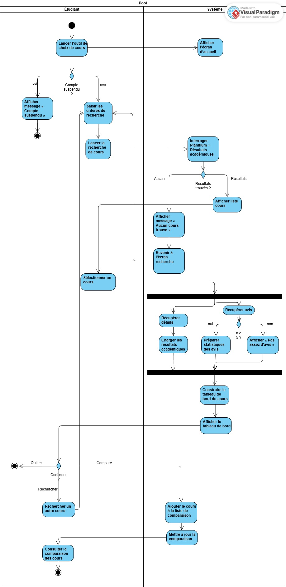

# Flux principaux

## Objectif
L'objectif est de décrire les flux d’interaction entre les acteurs et le système.

## Diagrammes
### Flux d'activité : Recherche de cours

Voici le diagramme d'activité UML représentant le processus de recherche de cours :

### Description des flux complexes

### Flux : Ouverture de la plateforme

L'étudiant fait le choix de cours et entre dans la palteforme. Le système redirige l’étudiant vers la page d’accueil personnalisée.

---

### Flux : Affichage des cours obligatoires

Lorsque l’étudiant accède à son tableau de cheminement personnel, le système identifie automatiquement son programme d’études (ex Baccalauréat en informatique) grâce à l’authentification. Ensuite, il interroge la base de données institutionnelle de l'udem, indépendamment de l’API Planifium, pour récupérer la liste des cours obligatoires et des préalables requis pour ceux ci.Les cours sont d’abord affichés avec les informations de base, par exemple la description du cours, le nom du professeur, l'horaire et des commentaires généraux.Chaque cours est accompagné d’un bouton “Détails” permettant à l’étudiant de consulter des indicateurs approfondis, incluant la charge de travail moyenne, le taux d'échec et l'évaluation globale donnée par les étudiants. À partir de cette fiche détaillée, l’étudiant peut comparer plusieurs cours obligatoires entre eux via la vue comparative intégrée. Il peut ainsi identifier les cours présentant un risque élevé ou une charge importante, et adapter sa sélection en fonction de ses préférences.

---

### Flux : Recherche de cours

Si l’étudiant souhaite ajouter un cours qui est hors programme il peut utiliser la fonction de recherche à partir d’un mot-clé tel que les sigles du cours ou le nom. Le système communique avec l’API Planifium et affiche les cours correspondants avec les informations de base comme le nom, l'horaire, le professeur ou la description. Ensuite, en cliquant sur un cours spécifique, l’étudiant accède aux informations détaillées (évaluation, charge, taux d’échec, commentaires). Comme pour les cours obligatoires, une vue comparative des cours est disponible après cette étape pour aider à la prise de décision.

---

### Flux : Personnalisation

Si l’étudiant a rempli son profil (préférence pour des cours plus théoriques ou intérêt en IA, etc), le système classe les résultats de recherche en fonction de ces préférences, grâce à un module de recommandation. Le système affiche le nom du cours sur l’interface. Lorsqu’un étudiant est intéressé, il peut cliquer pour consulter les détails. Ce mécanisme d’interaction  facilite l’identification rapide des cours pertinents selon les préférences individuelles. Le module apprend des interactions passées pour améliorer les recommandations.

---

### Flux : Comparaison

L’étudiant peut sélectionner plusieurs cours (ex: IFT2255, IFT2035) et accéder à une vue de comparaison. Cette fonctionnalité est disponible à partir de la fiche détaillée d’un cours (après avoir consulté l’évaluation, la charge de travail et le taux d’échec).  Le système génère alors un tableau  comparant les éléments suivants : charge horaire, moyenne d'évaluation, taux d'échec et commentaires anonymes d'étudiants. En parallèle, le système interroge l’API Planifium pour récupérer les horaires des cours sélectionnés (jour, heure, groupe, salle, session). Une vue de type calendrier permet à l’étudiant d’identifier les conflits, chevauchements ou plages libres, facilitant la construction d’un horaire optimal. Enfin, les commentaires d’anciens étudiants sont affichés en bas de l’interface comparative. Ceux-ci offrent des informations utiles sur le style d’enseignement, la difficulté selon les anciesns étudiants, ou l’organisation des cours. Lorsque plusieurs commentaires partagent un contenu similaire, ils sont regroupés automatiquement pour éviter la redondance. L’étudiant peut cliquer pour les développer individuellement s’il souhaite lire le détail. Cette combinaison d’indicateurs quantitatifs et qualitatifs permet à l’étudiant de faire un bon choix, en fonction de ses préférences personnelles et contraintes académiques.

---

