# Flux principaux

## Objectif
Décrire les flux d’interaction entre les acteurs et le système.

## Diagrammes
### 🔍 Flux d'activité : Recherche de cours

Voici le diagramme d'activité UML représentant le processus de recherche de cours :

```mermaid
flowchart TD
    start(Début) --> auth[Authentification de l'étudiant]
    auth --> detectProg[Détection automatique du programme]
    detectProg --> recommandation[Recommandation personnalisée selon le profil]
    recommandation --> parallele{"Choix de parcours"}

    %% Branche 1 : Cours obligatoires
    parallele --> obligatoires[Afficher cours obligatoires]
    obligatoires --> afficheOblig[Afficher : évaluation, charge de travaux, échec]
    afficheOblig --> clicOblig[Clique pour les détails: déscription du cours, professeur, temps et commentaires des étudiants ou vue comparative]
    clicOblig --> choixAjoutOblig{Ajouter ce cours au panier ?}
    choixAjoutOblig -- Oui --> ajoutOblig[Ajout dans le panier]
    choixAjoutOblig -- Non --> retourOblig[Retour à la liste des cours]
    retourOblig --> afficheOblig
    ajoutOblig --> verifOblig{Sélection réussie ?}
    verifOblig -- Oui --> fin1(Fin - sélection réussie)
    verifOblig -- Non --> echec1["Échec de la sélection"]
    echec1 --> msgErreur1["Afficher erreur (complet, conflit, etc.)"]
    msgErreur1 --> retourOblig[Retour à l’affichage des cours obligatoires]
    

    %% Branche 2 : Recherche de cours hors programme
    parallele --> recherche[Recherche de cours hors programme]
    recherche --> entreeMotCle[Entrer un mot-clé - sigle ou nom]
    entreeMotCle --> apiCall[Appel à l'API Planifium]
    apiCall --> resultats{Résultats trouvés ?}

    resultats -- Oui --> afficheCours[Afficher : évaluation, charge de travaux, échec]
    afficheCours --> clicDetails[Clique pour les détails: déscription du cours, professeur, temps et commentaires des étudiants ou vue comparative]
    clicDetails --> choixAjoutHors{Ajouter ce cours au panier ?}
    choixAjoutHors -- Oui --> ajoutHors[Ajout dans le panier]
    choixAjoutHors -- Non --> retourHors[Retour à la liste des résultats]
    retourHors --> afficheCours
    ajoutHors --> verifHors{Sélection réussie ?}
    verifHors -- Oui --> fin2(Fin - sélection réussie)
    verifHors -- Non --> echec2["Échec de la sélection"]
    echec2 --> msgErreur2["Afficher erreur (complet, conflit, etc.)"]
    msgErreur2 --> retourHors[Retour à la recherche]

    resultats -- Non --> rienTrouve["Aucun résultat"]
    rienTrouve --> nouvelleRecherche[Recommencer la recherche]
    nouvelleRecherche --> entreeMotCle
```

### Description des flux complexes

### Flux : Ouverture de la plateforme

L'étudiant fait le choix de cours et entre dans la palteforme. Le système redirige l’étudiant vers la page d’accueil personnalisée.

---

### Flux : Affichage des cours obligatoires

Lorsque l’étudiant accède à son tableau de cheminement personnel, le système identifie automatiquement son programme d’études (ex. Baccalauréat en informatique) grâce à l’authentification. Ensuite, il interroge une base de données institutionelle ou un fichier de règles programmé (ex. table de correspondance programme → cours obligatoires), indépendamment de l’API Planifium, pour récupérer la liste des cours obligatoires et des préalables requis. Ces cours sont affichés avec un indicateur visuel (ex. couleur ou icône) pour distinguer leur statut (obligatoire, déjà complété). L’étudiant peut ensuite filtrer ou trier cette liste pour planifier ses futures sessions plus efficacement. Ces données sont sauvegardées dans le profil de l’étudiant pour un accès rapide.

---

### Flux : Recherche de cours

Si jamais l’étudiant veut obtenir un cours à option(par exemple, le cours hors de programme), il peut utiliser la secion de recherche en utilisatn un mot-clé (sigle, nom ou sujet) dans la barre de recherche.le système interroge l’API Planifium et affiche les cours correspondants, incluant une évaluation moyenne, la charge de travail, le taux d’échec, une description du cours, le nom du professeur et des commentaires anonymes d’étudiants. Si aucun résultat n’est trouvé, des mots clés "Rien à trouver" va afficher dans la page et puis la barre de recherche apparaît et permet aux étudiants de rechercher à nouvaux.

---

### Flux : Personnalisation

Si l’étudiant a rempli son profil (préférence pour les cours pratiques, intérêt en IA, etc.), le système classe les résultats de recherche en fonction de ces préférences, grâce à un module de recommandation. Le système affiche le nom du cours sur l’interface. Lorsqu’un étudiant est intéressé, il peut cliquer pour consulter les détails. Ce mécanisme d’interaction simple et intuitif facilite l’identification rapide des cours pertinents selon les préférences individuelles. Le module apprend des interactions passées pour améliorer les recommandations.

---

### Flux : Comparaison

L’étudiant peut sélectionner plusieurs cours (ex: IFT2255, IFT2035) et ouvrir une vue comparative. Cette fonctionnalité est accessible à partir de la fiche détaillée d’un cours ou depuis la vue du panier avant la validation finale. Le système génère un tableau croisé indiquant : charge horaire, moyenne historique, taux d’échec, commentaires représentatifs. En même temps, l’étudiant souhaite éviter les conflits d’horaire entre plusieurs cours. Lorsqu’il sélectionne des cours à comparer, le système interroge l’API Planifium pour récupérer les horaires disponibles (jour, heure, groupe, salle, session). Une vue en calendrier (type Google Agenda) s’affiche, permettant de visualiser les superpositions, les conflits ou les zones libres. L’étudiant peut ainsi ajuster sa sélection. En bas de l’interface de comparaison, des commentaires anonymes provenant d’anciens étudiants sont affichés. Ces commentaires permettent de mieux comprendre le style d’enseignement des professeurs, la difficulté réelle du cours, et d’autres éléments subjectifs.Si plusieurs commentaires affichent un contenu similaire, ils sont regroupés automatiquement pour éviter la redondance. L’étudiant peut cliquer pour les développer individuellement s’il souhaite voir le détail de chaque avis. Cette information qualitative complète les données chiffrées pour aider l’étudiant à faire un choix éclairé selon ses préférences personnelles. 

---

### Flux : Échec de la sélection de cours

Il peut arriver que l’étudiant rencontre un échec lors de la tentative de validation de sa sélection de cours. Cela peut être dû à plusieurs raisons :
- Un ou plusieurs cours choisis ont des préalables non complétés ;
- Il existe des conflits d’horaire entre des cours sélectionnés ;
- Le cours est complet et aucune place n’est disponible ;
- Le cours sélectionné est restreint à un programme ou un statut spécifique.

Dans ce cas, le système affiche un message d’erreur clair précisant la ou les causes du rejet. En fonction du problème, plusieurs solutions sont proposées à l’étudiant :
- **Cours complet :** possibilité d’ajouter une alerte (“à surveiller”) pour être notifié si une place se libère ;
- **Conflit d’horaire :** le système propose automatiquement d’autres groupes ou combinaisons de cours compatibles ;
- **Préalables manquants :** une explication est affichée, accompagnée d’un lien vers le cheminement académique suggéré pour compléter les préalables ;
- **Restriction de programme :** une mention explicite indique que ce cours est réservé à certains profils. Une liste d’alternatives similaires est suggérée.

L’objectif est de fournir un accompagnement intelligent et transparent pour permettre à l’étudiant de corriger sa sélection et de finaliser son parcours sans frustration. Si une erreur inconnue se produit, un message de type “Erreur système” s’affiche, avec l’instruction suivante : “Veuillez contacter l’équipe de TGDE pour obtenir de l’aide,” et en indiquant le courrier. 

---

### Flux : Sélection finale

Après avoir consulté les comparaisons et les horaires, l’étudiant souhaite finaliser ses choix de cours pour une session donnée. Il clique sur le bouton “Valider ma sélection”.

Le système vérifie la cohérence de la combinaison (préalables respectés, absence de conflits horaires) et propose ensuite plusieurs actions :
- Exporter la grille finale en format PDF (incluant nom du cours, horaire, charge estimée)
- Synchroniser les horaires validés avec son compte Google Agenda
- Ajouter un tag “à surveiller” pour les cours d’intérêt (ce qui active des notifications si une place se libère ou si un avis est ajouté)

Cette étape conclut le parcours de sélection, et prépare l’étudiant à passer à l’inscription officielle ou à sauvegarder ses choix pour consultation ultérieure.

---

