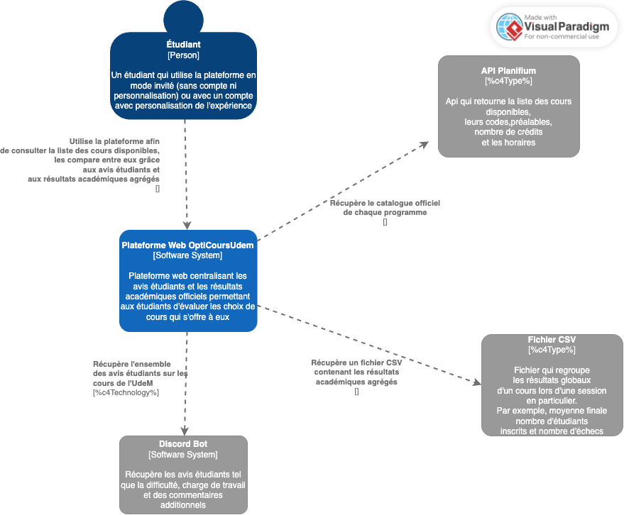
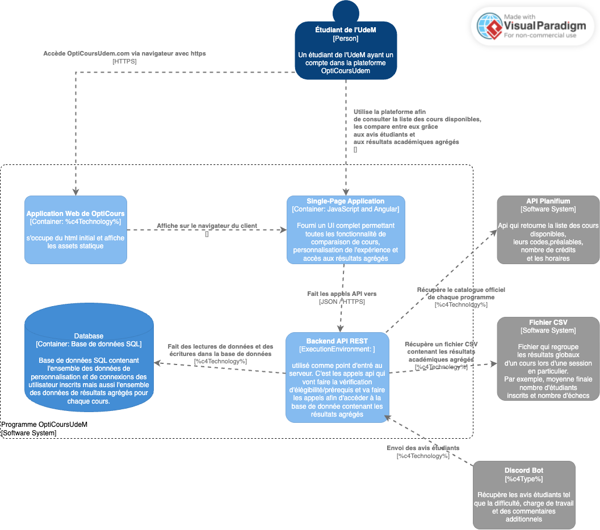

# Architecture du système

## Vue d’ensemble

Le système adopte une architecture **client-serveur** avec une séparation claire entre **frontend** et **backend**.  
- **Type** : Architecture basée sur une **API REST**.  
- **Raisons du choix** :  
  - Simple à mettre en place et à maintenir.  
  - Intégration facile avec des services externes (API Planifium, Bot Discord)  
  - Au besoin on pourra étendre le service sur mobile facilement 

---

## Composants principaux

- **Frontend Web** :  
  - Interface utilisateur (tableaux de bord, recherche de cours, comparaison).  
  - Communication avec le backend via des appels HTTP avec l'API REST.  

- **Backend / API REST** :  
  - S'occupe de toute la logique derrière la gestion des cours, comparaison, personnalisation du profil.  
  - Centralise les données provenant de Planifium, Discord et la base interne.  

- **Base de données** :  
  - Stockage des résultats académiques et des avis étudiants.  
  - S'occupe aussi du stockage et de la gestion des profils utilisateurs.  

- **Modules spécialisés** :  
  - Authentification (connexion, gestion des comptes).  
  - Moteur de recherche (cours par mots-clés, codes, titres).  
  - Moteur de comparaison (évaluer charge et compatibilité).  
  - Gestion des avis (agrégation des retours étudiants).  

---

## Communication entre composants

- **Frontend → Backend** : Appels HTTP REST.  
- **Backend → Planifium API** : Récupération des données officielles (JSON).  
- **Backend → Bot Discord** : Collecte et agrégation des avis étudiants (JSON).  
- **Backend → Base de données** : Requêtes SQL (ou NoSQL si besoin de flexibilité).  
- **Formats de données** :  
  - **JSON** pour API et échanges.  
  - **CSV** pour les résultats académiques agrégés.  

---

## Diagramme d’architecture (Modèle C4)

### Niveau 1 – Vue du système
- **Acteurs externes** : Étudiant, API Planifium, Bot Discord.  
- **Système étudié** : Plateforme web de choix de cours.  
- **Interactions principales** :  
  - Étudiant ↔ Plateforme (recherche, comparaison, personnalisation).  
  - Plateforme ↔ API Planifium (informations officielles).  
  - Plateforme ↔ Bot Discord (avis étudiants).

    

### Niveau 2 – Vue des conteneurs
- **Frontend Web** (navigateur étudiant).  
- **Backend / API REST** (logique métier et orchestration) 
- **Base de données interne** (profils, avis, résultats) 
- **API externes** : Planifium.
- **Bot externe** : Bot Discord (envoi les avis des étudiants)
- **Fichier CSV** : Fichier contenant les résultats agrégés.

