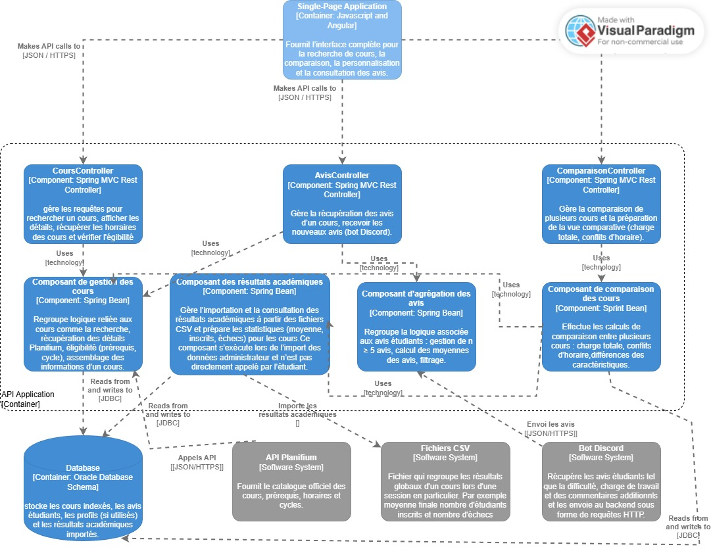

# Architecture du système

## Vue d’ensemble

Le système adopte une architecture **client-serveur** avec une séparation claire entre **frontend** et **backend**.  
- **Type** : Architecture basée sur une **API REST**.  
- **Raisons du choix** :  
  - Simple à mettre en place et à maintenir.  
  - Intégration facile avec des services externes (API Planifium, Bot Discord)  
  - Au besoin on pourra étendre le service sur mobile facilement 

---

## Composants principaux

- **Frontend Web** :  
  - Interface utilisateur (tableaux de bord, recherche de cours, comparaison).  
  - Communication avec le backend via des appels HTTP avec l'API REST.  

- **Backend / API REST** :  
  - S'occupe de toute la logique derrière la gestion des cours, comparaison, personnalisation du profil.  
  - Centralise les données provenant de Planifium, Discord et la base interne.  

- **Base de données** :  
  - Stockage des résultats académiques et des avis étudiants.  
  - S'occupe aussi du stockage et de la gestion des profils utilisateurs.  

- **Modules spécialisés** :  
  - Authentification (connexion, gestion des comptes).  
  - Moteur de recherche (cours par mots-clés, codes, titres).  
  - Moteur de comparaison (évaluer charge et compatibilité).  
  - Gestion des avis (agrégation des retours étudiants).  

---

## Communication entre composants

- **Frontend → Backend** : Appels HTTP REST.  
- **Backend → Planifium API** : Récupération des données officielles (JSON).  
- **Backend → Bot Discord** : Collecte et agrégation des avis étudiants (JSON).  
- **Backend → Base de données** : Requêtes SQL (ou NoSQL si besoin de flexibilité).  
- **Formats de données** :  
  - **JSON** pour API et échanges.  
  - **CSV** pour les résultats académiques agrégés.  

---

## Diagramme d’architecture (Modèle C4)

### Niveau 1 – Vue du système
- **Acteurs externes** : Étudiant, API Planifium, Bot Discord.  
- **Système étudié** : Plateforme web de choix de cours.  
- **Interactions principales** :  
  - Étudiant ↔ Plateforme (recherche, comparaison, personnalisation).  
  - Plateforme ↔ API Planifium (informations officielles).  
  - Plateforme ↔ Bot Discord (avis étudiants).

    

### Niveau 2 – Vue des conteneurs
- **Frontend Web** (navigateur étudiant).  
- **Backend / API REST** (logique métier et orchestration) 
- **Base de données interne** (profils, avis, résultats) 
- **API externes** : Planifium.
- **Bot externe** : Bot Discord (envoi les avis des étudiants)
- **Fichier CSV** : Fichier contenant les résultats agrégés.

### Niveau 3 – Vue des composantes (Backend API REST)

- **Conteneur détaillé** : Backend API REST de la plateforme OptiCoursUdeM.   
- **Organisation** :  
  - Contrôleurs REST (interface d’entrée).  
  - Composantes métier (logique interne).  
  - Systèmes externes (BD, API, CSV, Bot Discord).

#### Composantes internes
- **CoursController**  
  Traite les requêtes liées à la recherche de cours, à l’affichage des détails et à la vérification de l’éligibilité.

- **AvisController**  
  Reçoit les avis étudiants et permet la consultation des avis d’un cours.

- **ComparisonController**  
  Gère la comparaison de plusieurs cours et la préparation de la vue comparative tel qie charge totale et conflits d’horaire.

---

- **Composant de gestion des cours**  
  Logique liée aux cours : recherche, assemblage des données officielles obtenu avec Planifium, prérequis, cycle et construction de la fiche détaillée.

- **Composant d’agrégation des avis**  
  Filtre et agrège les avis étudiants, applique la règle *n ≥ 5* et calcule les statistiques (difficulté du cours sur 5 selon les avis, charge de travail selon les avis, commentaires).

- **Composant de comparaison des cours**  
  Calcule la charge totale estimée, détecte les conflits d’horaire et affiche les caractéristiques lors de la comparaison.

- **Composant des résultats académiques**  
  Importe les fichiers CSV, extrait les statistiques tel que les moyenne, inscriptions , échecs et les stocke dans la base de données.

---

#### Systèmes externes utilisés

- **Base de données interne (SQL)**  
  Contient les cours indexés, les avis, les profils étudiants, et les résultats académiques importés.

- **API Planifium**  
  Fournit les informations officielles (titre, prérequis, crédits, horaires, cycles).

- **Fichiers CSV (résultats académiques)**  
  Source de données pour les moyennes, le nombre d’inscrits et le nombre d’échecs.

- **Bot Discord**  
  Envoie les avis étudiants vers l’API sous forme de requêtes HTTP, traitées par AvisController.

### Justification des choix du design 

Pour la conception de notre backend, on a essayé d’utiliser les principes d’architecture qu'on a vu dans le cours, t.q l’abstraction, le faible couplage, la cohésion forte et l’encapsulation. Même si notre implémentation actuelle pour la phase 2 est simple et on utilise une API REST avec Javalin et une interface CLI sans base de données ni modules avancés, on a quand même essayé d'organiser la conception de notre backend comme une architecture modulaire qui pourra plujs tard supporter les fonctionnalités plus complètes prévues dans l’énoncé. Par exemple, les interactions avec les sources externes comme Planifium sont déjà isolées dans HttpClientApi, ce qui va faciliter plus tard l’ajout d’un vrai client d’intégration, d’un store JSON ou d’une BD. On a aussi regroupé chaque responsabilité dans un service t.q CourseService pour la recherche, les détails et l’éligibilité, et ainsi on augmente la cohésion et on évite que la logique se disperse dans les contrôleurs ou dans notre CLI. On encapsule les données derrière ces services et donc l’interface CLI actuellement ou l'interface web dans le futur n’a pas besoin de connaître les détails internes et donc ça rend le système plus clair et plus testable et surtout plus facile à faire évoluer. Même si tout n’est pas encore implémenté comme dans nos diagrammes de conception, on a essayé de penser la structure actuelle pour rester flexible pour les prochaines versions du projet.

