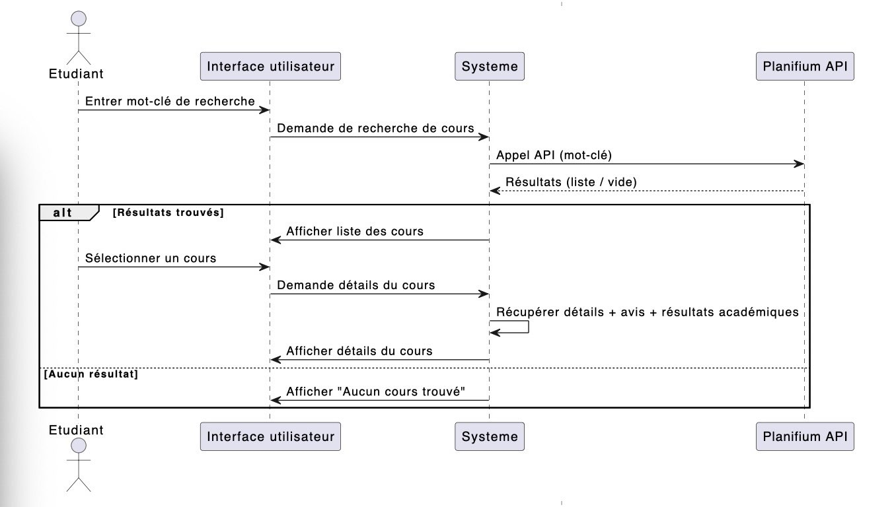
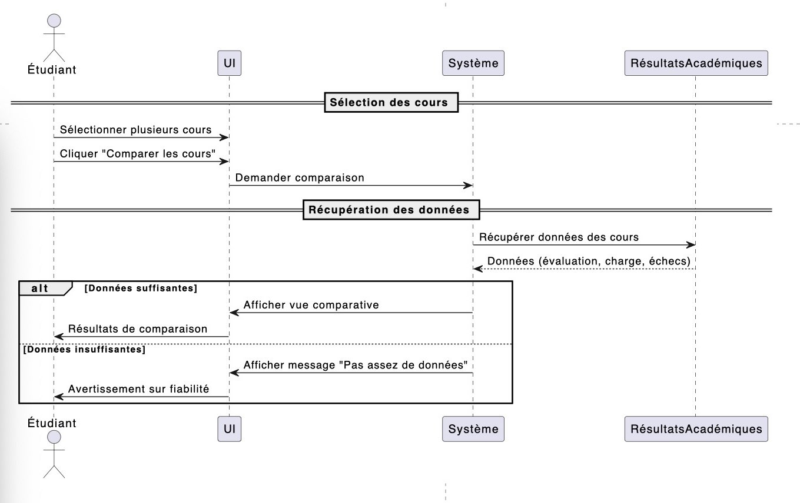
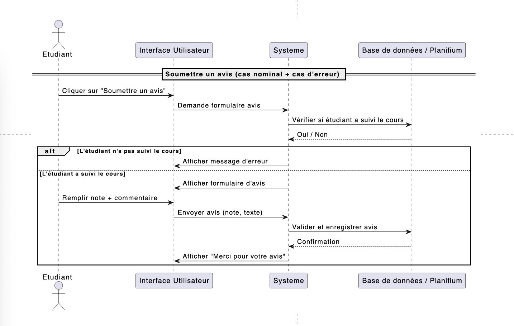

# Diagrammes UML

## Diagrammes de classes

- Modèle de données orienté objet
## Diagrammes de séquence
### Diagramme de séquences de recherche de cours

### Diagramme de séquences de comparaison du cours

### Diagramme de séquences de soumission du cours

- Exécution pas à pas d’un scénario type
